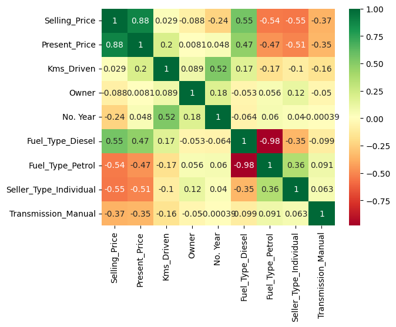
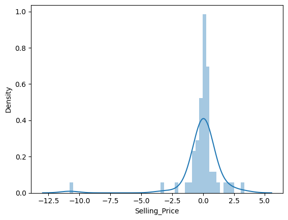
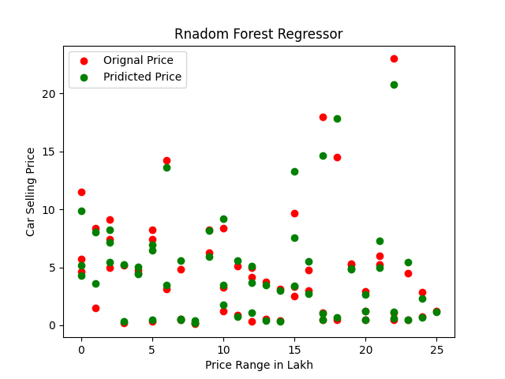

# Car_Selling_Price_Prediction
In this project we used Random Forest Regressor to find the selling price of car. 
CarDekho.com is India's leading car search venture. Its website and app carry rich automotive content such as expert reviews, detailed specs and prices, comparisons as well as videos and pictures of all car brands and models available in India. Each car has a Current selling price, which is the price for buying the car on this site, and a MRP, which is the retail price of the car. These two prices differ depending on factors such as brand, make year, mileage, condition, etc.
## Technical Aspect:
Trained a Machine Learning model using Random Forest Regressor (Code is available in this repo)
## Deployment

To deploy this project run

```bash
  pip install -r Requirements.txt
```
## Result
#### (a) Correlation Between Features


```bash
This graph represents the correlation between the selected features. 
For example Selling_price is dependent on Present_Price, Fuel_Type_Diesel and Kms_Driven. 
Similarly, Present price has positively corelated to Selling_price, Fuel_Type_Diesel and Kms_Driven
```

#### (b) Distribution plot


```bash
This graph shows the difference between predicted Price and actual price. 
It can be seen that density of difference between both the prices are distributed 
nearly zero which represents that most of the time both the values are nearly the same.
```   

#### (c) Pridicted Prices  

```bash
In the above figure we represented the comparison of actual prices to the predicted prices.
Actual prices are represented by green color while predicted prices through Regression tree
is represented in red color.  Predicted prices are nearly same as the actual prices which represents 
the accuracy of the our Model. 

```

## Credits
Dataset: The dataset contains information about used cars is taken from Kaggle listed on www.cardekho.com.
Dataset Link: https://www.kaggle.com/nehalbirla/vehicle-dataset-from-cardekho
